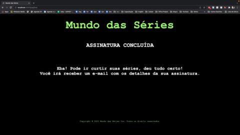
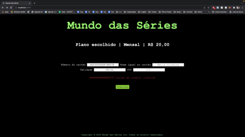

<h1 align="center"> Cartão de Crédito Válido </h1>
<h4 align="center">Status do projeto: Concluído ✅</h4>

## Índice

- [Descrição](#Descrição)
- [Funcionalidades](#Funcionalidades)
- [Layout](#Layout)
- [Como Executar o Projeto](#Como-Executar-o-Projeto)
- [Tecnologias Utilizadas](#Tecnologias-Utilizadas)
- [Autora](#Autora)

---

## Descrição
Esse projeto foi desenvolvido com o intuito de validar um cartão de crédito ou débito, através do algoritmo de Luhn.
Foi desenvolvido uma pagina de um serviço fictício de streaming, para fazer uma assinatura é necessário o uso do cartão de crédito para efetuar a compra, ou seja, precisa verificar se o numero do cartão é válido ou não. 
Na página ao digitar os números de um cartão válido e clicar no botão “Finalizar" o usuário será direcionado a uma nova pagina onde confirma a assinatura, agora caso o número seja invalido irá aparecer uma mensagem logo acima do botão informando essa invalidade e os últimos quatro números estarão visíveis e os outros estarão mascarados  com a “#”.

---

## Funcionalidades
- Verifica se o número do cartão digitado pelo usuário é valido ou não.
- Adverte caso o usuario digite um número insuficientes de dígitos.
- Esconde através da “#” os primeiros números do cartão deixando visível apenas os quatro últimos.

---

## Layout
Web

Imagem 1. Página onde o usuário coloca seus dados para finalizar a assinatura.

Imagem 2. Página que confirma a assinatura, consequentemente a validade do cartão.

Imagem 3. Página informando que o número do cartão é inválido.

---

## Como Executar o Projeto
Para conseguir rodar a aplicação e os teste é necessário ter instalado na sua máquina o [Git](https://git-scm.com/), [Node.js](https://nodejs.org/en/)  e um editor de código da sua escolha.

- No terminal, clone o projeto:
  - git clone https://github.com/jaquelinedeoliveira93/SAP007-card-validation
- Entre na pasta do projeto:
  - cd SAP007-card-validation
- Instale as dependencias:
  - npm install
- Execute a aplicação:
  - npm start

Para realizar os testes, faça o seguinte:
- No terminal, na pasta do projeto:
  - cd SAP007-card-validation
- Execute o teste:
  - npm test

---

## Tecnologias utilizadas
- HTML5
- CSS3
- JavaScrip
- Node.js
- Git

---

## Autora
Jaqueline de Oliveira - [LinkedIn](https://www.linkedin.com/in/jaquelinedeoliveiraa/) - [GitHub](https://github.com/jaquelinedeoliveira93)